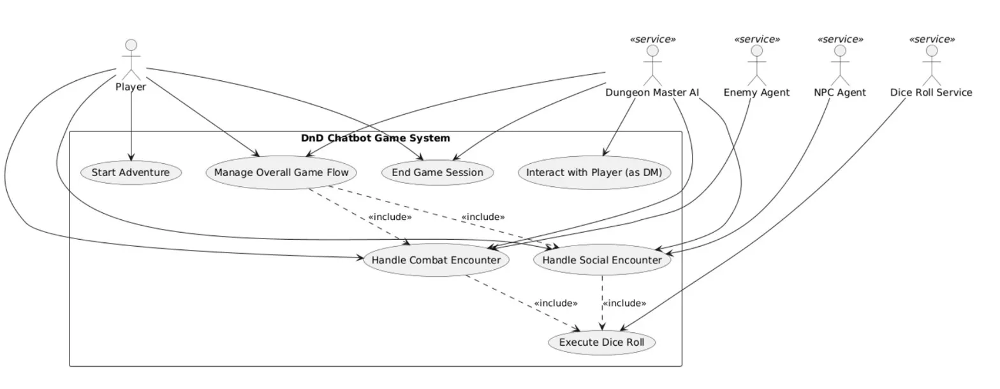

# DnD Chatbot

# Use Case Diagram

# Implemented Use Case: Execute Dice Roll

Out of the use cases presented in the diagram, I implemented `Execute Dice Roll`.

This use case is included by both `Handle Combat Encounter` and `Handle Social Encounter`, making it the most foundational mechanic in the system. However, `Handle Combat Encounter` and `Handle Social Encounter` are not fully implemented yet and are free-form right now.

# What We Did

I connected the `roll_dice` tool from the MCP server to the LangGraph ReAct agent, allowing the Dungeon Master AI to call it automatically during play. When the player takes an action that requires a roll, such as attacking an enemy or making a skill check, the agent calls `roll_dice` silently, receives the numeric result, and uses it as input to `calculate_damage` before narrating the outcome. In theory.

In reality the agent still occasionally screws up the roll call. However, this will be fixed as development continues for `Handle Combat Encounter` and `Handle Social Encounter`.

I also spent time prompt engineering the system prompt in an attempt to ensure the model never leaks raw tool call JSON to the player, and follows the pattern of Roll -> Damage Calculation -> Narration.